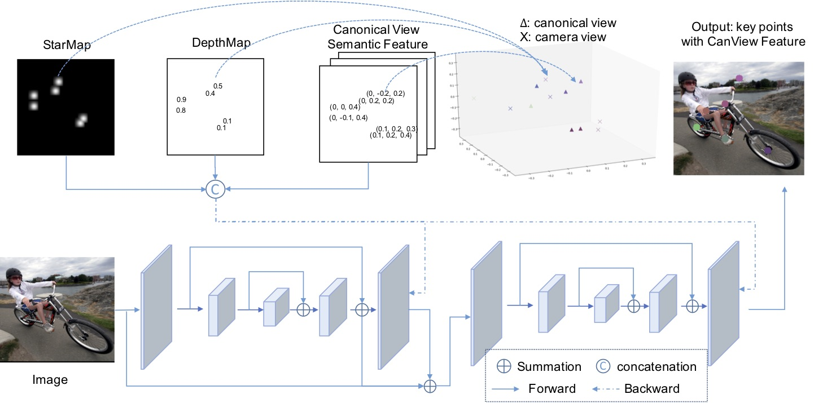
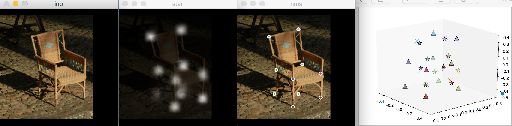
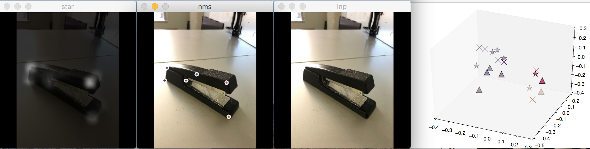

# StarMap for Category-Agnostic Keypoint and Viewpoint Estimation

PyTorch implementation for **category-agnostic** keypoint and viewpoint estimation.




> Xingyi Zhou, Arjun Karpur, Linjie Luo, Qixing Huang,     
> **StarMap for Category-Agnostic Keypoint and Viewpoint Estimation**      
> ECCV 2018 ([arXiv:1803.09331](https://arxiv.org/abs/1803.09331))

Supplementary material with more qualitative results and higer resulution can be found [here](https://drive.google.com/file/d/1IEcHBdQ8u2HTKiNz88ItJWDRQUOJnf60/view?usp=sharing).


Contact: [zhouxy2017@gmail.com](mailto:zhouxy2017@gmail.com). Any questions or discussions are welcomed! 

## Abstract 

Previous methods for keypoints can only be applied to one specific category of fixed topology. As a result, this keypoint representation is not suitable when objects have a varying number of parts, e.g. chairs with varying number of legs. 
We propose a category-agnostic keypoint representation encoded with their 3D locations in the canonical object views. 
Our intuition is that the 3D locations of the keypoints in canonical object views contain rich semantic
and compositional information. 
Our representation thus consists of
a single channel, multi-peak heatmap (StarMap) for all the keypoints and their corresponding features as 3D locations in the canonical object view (CanViewFeature). Additionally, we show that when augmented with an additional depth channel (DepthMap) to lift the 2D keypoints to 3D,
our representation can achieve state-of-the-art results in viewpoint estimation.


## Installation
The code was tested with [Anaconda](https://www.anaconda.com/download) Python 2.7 and [PyTorch]((http://pytorch.org/)) v0.3. via wheel. (You may need to try different variants of this version; for e.g., _torch-0.3.0.post4-cp27-cp27m-linux_x86_64.whl_ works for ubuntu 20.04). After install Anaconda and Pytorch:

1. Clone the repo:

~~~
STARMAP_ROOT=/path/to/clone/StarMap
git clone https://github.com/xingyizhou/StarMap STARMAP_ROOT
~~~


2. Install dependencies (h5py, opencv, and progressbar):

~~~
conda install h5py
conda install --channel https://conda.anaconda.org/menpo opencv
conda install --channel https://conda.anaconda.org/auto progress
~~~

3. Optionally, install tensorboard for visializing training. 

~~~
pip install tensorflow
~~~

4. Run
```console
$ mv STARMAP_ROOT/lib/paths.py.examples STARMAP_ROOT/lib/paths.py
```

## Demo
- Download our pre-trained [model](https://drive.google.com/file/d/1bwCeC4F0OLFYceiaAuUGB6pU8OOZor1k/view?usp=sharing) (trained on Pascal3D+ dataset, or alternatively [model](https://drive.google.com/file/d/1iDtcq_gQBuguTmzpENn6Vru7dr39Grv-/view?usp=sharing) trained on ObjectNet3D dataset) and move it to `STARMAP_ROOT/models`.
- Run 

```
cd STARMAP_ROOT/tools
python demo.py -demo /path/to/image [-loadModel /path/to/model/] [-GPU 0]
```
The demo code runs in CPU by default. 

We provide example images in `STARMAP_ROOT/images/`. 
The results are shown with predicted canonical view (triangle), the predicted 3D keypoints (cross), and the rotated keypoints with the estimated viewpoint (star). If setup correctly, the output will look like:




We also provide some custom images of novel categories in `STARMAP_ROOT/images/`. The expected results should be:




## Setup Datasets

If you want to reproduce the results in the paper for benchmark evaluation and training, you will need to setup dataset.

1. Download and extract [Pascal3D+](http://cvgl.stanford.edu/projects/pascal3d.html) dataset (~7.5G). 

~~~
cd STARMAP_ROOT/data
wget ftp://cs.stanford.edu/cs/cvgl/PASCAL3D+_release1.1.zip
unzip PASCAL3D+_release1.1.zip
~~~

2. Setup the path.

~~~
mv STARMAP_ROOT/lib/paths.py.examples STARMAP_ROOT/lib/paths.py
~~~

You can change the dataset path in `STARMAP_ROOT/lib/paths.py` in put the dataset elsewhere.  

3. Convert the annotation. 

~~~
cd STARMAP_ROOT/tools
python getPascal3DDataset.py
~~~

Optionally, setup the [ObjectNet3D](http://cvgl.stanford.edu/projects/objectnet3d/) dataset (~7G) following the similar commands and run `python getObjectNet3DDataset.py`

## Benchmark Evaluation
- Evaluate viewpoint estimation on Pascal3D+ (Table. 2 in the paper):

  - Download our pre-trained [model](https://drive.google.com/file/d/1bwCeC4F0OLFYceiaAuUGB6pU8OOZor1k/view?usp=sharing) on Pascal3D+ and move it to `STARMAP_ROOT/models`.

  - Run the network to get the feature predictions (Our result [here](https://drive.google.com/file/d/18JQmie7_H-xuzymuzMqYgNPBxWSEekRy/view?usp=sharing)).

~~~
cd STARMAP_ROOT/tools
python main.py -expID Pascal3D -task starembdep -loadModel ../models/Pascal3D-cpu.pth -test
~~~

  - Align the predicted keypoints and the predicted features to solve viewpoint. 
  
~~~
python EvalViewPoint.py ../exp/Pascal3DTEST/preds.pth
~~~

  - The result should be:

 |        |aeroplane|bicycle |boat    |bottle  |bus     |car     |chair   |diningtable|motorbike|sofa    |train   |tvmonitor| Mean |
|--------|--------|--------|--------|--------|--------|--------|--------|--------|--------|--------|--------|--------|--------|
| Acc10  |0.4982  |0.3475  |0.1466  |0.5737  |0.8896  |0.6786  |0.4549  |0.2857  |0.2794  |0.4615  |0.5929  |0.3739  |0.4851 |
| Acc30  |0.8218  |0.8559  |0.5043  |0.9243  |0.9740  |0.9156  |0.7910  |0.6190  |0.8750  |0.9231  |0.7699  |0.8288  |0.8235 |
| Mid    |  10.05 |  14.50 |  29.42 |   9.02 |   3.02 |   6.29 |  11.13 |  23.66 |  14.23 |  10.97 |   7.41 |  13.14 |  10.38|

- Evaluate keypoint classification on Pascal3D+ (Table. 1 in the paper):
  - Run 
 
~~~
 cd STARMAP_ROOT/tools
 python EvalPTPCK.py ../exp/Pascal3DTEST/preds.pth
~~~

  - The result should be:
 
 |        |aeroplane|bicycle |boat    |bottle  |bus     |car     |chair   |diningtable|motorbike|sofa    |train   |tvmonitor| Mean |
|--------|--------|--------|--------|--------|--------|--------|--------|--------|--------|--------|--------|--------|--------|
| Acc    |0.7505  |0.8343  |0.5529  |0.8718  |0.9439  |0.8984  |0.7545  |0.5802  |0.6867  |0.7901  |0.5385  |0.8610  |0.7858 |

- Evaluate viewpoint evaluation on ObjectNet3D dataset.
 download our [model](https://drive.google.com/file/d/1iDtcq_gQBuguTmzpENn6Vru7dr39Grv-/view?usp=sharing), move it to `STARMAP_ROOT/models`, and run 

~~~
cd STARMAP_ROOT/tools
python main.py -expID ObjectNet -dataset ObjectNet3D -task starembdep -loadModel ../models/ObjectNet3D-all-cpu.pth -test
python EvalViewPointObjectNet3D.py ../exp/ObjectNet3DTEST/preds.pth
~~~


## Training

- Training viewpoint estimation.

~~~
cd STARMAP_ROOT/tools
~~~

  1. Train the **Starmap**: [log](https://drive.google.com/file/d/1XOl2rga4ngQf8-i3kTp7eiYiwKRL7kXK/view?usp=sharing), [model](https://drive.google.com/file/d/1bhS4RUG4NvK1flAGfjm1rLdYctG61KBS/view?usp=sharing)

~~~
python main.py -expID Pstar -task star
~~~

  2. Train **Starmap** and **CanviewFeature**: [log](https://drive.google.com/file/d/1zVoSl2YFoeTMIneq47TrPfMvuo1rzOzu/view?usp=sharing), [model](https://drive.google.com/file/d/1aZnpAe0J93iqiViiJ4jD1a6-BUE0SCuA/view?usp=sharing)

~~~
python main.py -expID Pstaremb -task staremb -loadModel ../exp/Pstar/model_last.pth -dropLR 60
~~~

  3. Train **Starmap**, **CanviewFeature**, and **DepthMap**: [log](https://drive.google.com/file/d/1oWt-CZJrT7QtDd9IPIVkRtDbgGDroWrY/view?usp=sharing), [model](https://drive.google.com/file/d/1bwCeC4F0OLFYceiaAuUGB6pU8OOZor1k/view?usp=sharing)

~~~
python main.py -expID Pstarembdep -task starembdep -loadModel ../exp/Pstaremb/model_last.pth -dropLR 60
~~~

- For training on ObjectNet3D dataset, add `-dataset ObjectNet3D` to the above commends (and of course, change the expID and loadModel path). And set `-ObjectNet3DTrainAll` to train on all objects (by default it leaves 20 categories for testing only). 

- We also provide our implementation of the resnet baselines discussed in Table.2 following [Viewpoint and Keypoint](https://github.com/shubhtuls/ViewpointsAndKeypoints). 

  - Category agnostic:
~~~
 python main.py -expID cls -task cls -arch resnet18 -trainBatch 32 -LR 0.01 -dropLR 20
~~~

  - Category specific:
~~~
 python main.py -expID clsSpec -task cls -arch resnet18 -trainBatch 32 -LR 0.01 -dropLR 20 -specificView
~~~
- For more training options, see `lib/opts.py`


## Citation
    @InProceedings{zhou2018starmap,
    author = {Zhou, Xingyi and Karpur, Arjun and Luo, Linjie and Huang, Qixing},
    title = {StarMap for Category-Agnostic Keypoint and Viewpoint Estimation},
    journal={European Conference on Computer Vision (ECCV)},
    year={2018}
    }
